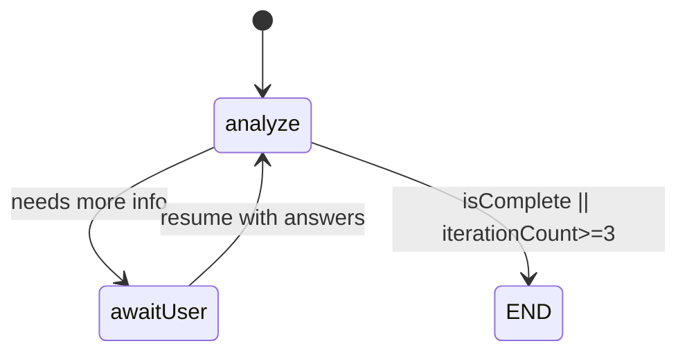
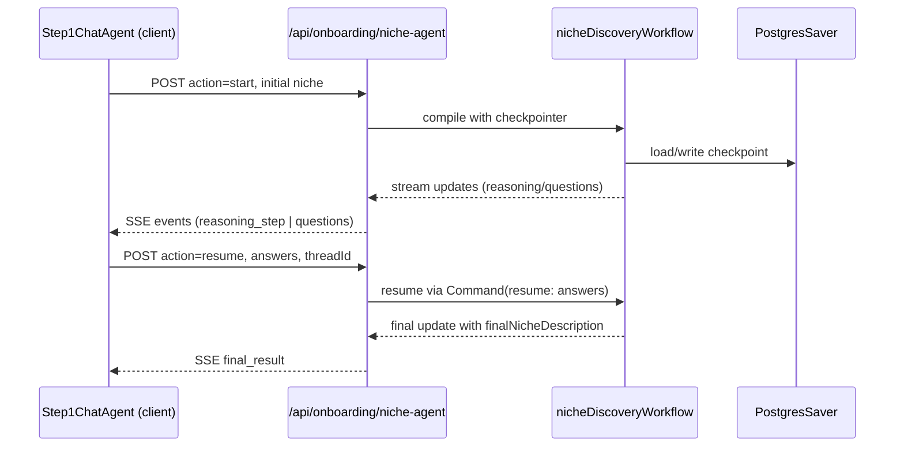

# Onboarding Niche Agent (LangGraph) – Developer Notes

## What this agent does
- Runs a LangGraph state machine to iteratively refine a creator’s niche during onboarding.
- Streams intermediate reasoning and follow-up questions to the UI via Server‑Sent Events (SSE), then persists the resulting niche and follow-up answers into the onboarding flow.
- Persists graph checkpoints to Postgres so a conversation can pause for user answers and resume without losing context.

## Key modules
- `lib/ai/agents/niche-discovery-agent.ts`: LangGraph workflow definition, state annotations, and node logic.
- `lib/ai/agents/checkpointer.ts`: Postgres checkpointer factory used by LangGraph.
- `lib/validations/onboarding/*`: Zod schemas for agent output (`analysisSchema`), niche shapes, and onboarding form steps.
- `app/api/onboarding/niche-agent/route.ts`: Next.js route handler that compiles the graph with checkpointing and streams SSE events to the client.
- `components/onboarding/steps/step-1-chat-agent.tsx`: Client that calls the route, decodes SSE updates, renders reasoning, asks questions, and feeds answers back.
- `app/actions/onboarding.ts`: Supabase persistence for the completed onboarding profile (structured logging example lives here).

## LangGraph workflow
- **State (`NicheAgentState`)**: annotated keys for `initialNiche`, `reasoningSteps[]` (concat reducer), `questions[]` (replace reducer), `userAnswers` (merge reducer), `iterationCount`, `finalNicheDescription`, `isComplete`.
- **Model**: `getModel(AI_MODELS.GROK_REASONING)` with `withStructuredOutput(analysisSchema)` guarantees Zod‑validated agent responses.
- **Nodes**
  - `analyze` (async): builds a coaching prompt, invokes the structured model, returns reasoning steps, optional new questions, `isComplete`, `finalNicheDescription`, and increments `iterationCount`.
  - `awaitUser`: calls `interrupt({ questions })` so LangGraph persists state and waits for answers; resumed answers merge into `userAnswers` and clear `questions`.
- **Edges**: `START -> analyze`; conditional from `analyze` to `awaitUser` or `END` via `shouldContinue` (ends if `isComplete` or `iterationCount >= 3`); `awaitUser -> analyze` loop.

### State machine diagram

## Checkpointing
- `getCheckpointer()` lazily creates a singleton `PostgresSaver` with `pg.Pool` using `process.env.DATABASE_URL` (SSL allowed, idle/connection timeouts tuned).
- `checkpointer.setup()` auto-creates the required LangGraph tables if they don’t exist.
- Every graph compile in the route injects this checkpointer so `interrupt`/resume spans HTTP requests and survives restarts.

## Zod schemas
- `analysisSchema` (`lib/validations/onboarding/agent.ts`): structured response with `reasoningSteps`, `isComplete`, `questions[]` (using `nicheAgentQuestionSchema`), and `finalDescription` (`detailedNicheSchema | null`).
- `detailedNicheSchema` (`niche.ts`): `{ niche, subNiche, contentPillars[], targetAudience, tone, doesCurrentAffairs }`.
- `nicheAgentQuestionSchema` (`niche.ts`): `{ id, content, options[{label,value}], allowCustom }`.
- Onboarding step schemas (`questions.ts`): compose `completeOnboardingSchema` for the multi-step UI (niche result + goal + platforms + experience + frequency).

## Route handler (`app/api/onboarding/niche-agent/route.ts`)
- Accepts `{ action, niche, answers, threadId? }`.
- Ensures a `thread_id` (existing or `crypto.randomUUID`) and passes it via `configurable` to LangGraph for checkpoint lookup.
- Compiles the graph with the Postgres checkpointer each request (safe because compilation is cheap and uses the shared saver).
- For `action === "start"` builds input `{ initialNiche }`; for `resume` sends `new Command({ resume: answers })` to un-block the `interrupt` node.
- Streams `updates` mode SSE to the client. Each LangGraph update is inspected; the handler emits typed events:
  - `reasoning_step` (multiple, ordered)
  - `questions` (with `threadId` so client can resume)
  - `final_result` (with `detailedNiche` + reasoning summary)
- Errors are currently surfaced via `console.error` and an `error` SSE event; structured logging can be added via `lib/logger` (see below).

### Request/response flow

## Client integration (`components/onboarding/steps/step-1-chat-agent.tsx`)
- Uses `fetch` with `POST` to the route; consumes SSE by manually reading the stream.
- Maintains `threadId`, `reasoningSteps`, `currentQuestionSet`, `answers`, and `finalResult` in React state.
- On `questions` event: renders multiple-choice + custom input UI; on final result: shows a modal/drawer summary and triggers `onChange(finalResult)` to advance onboarding.
- SSE parsing expects `event:` + `data:` lines; buffer handles partial chunks.

## Structured logging touchpoints
- Logger utility: `lib/logger.ts` (Pino + Trigger.dev), supports `.child()` bindings; include `userId`, `action`, and status codes.
- Current implementation:
  - `app/actions/onboarding.ts` uses `logger.child({ module: 'onboarding' })` and logs Supabase operations (includes `userId`, `action`, errors). Console calls remain and should be replaced with structured logs for consistency.
  - `route.ts` and client-side components currently use `console.*`; replacing with the logger (or a client-safe telemetry wrapper) will align with AGENTS.md guidance.

## Persistence after agent
- Final niche (DetailedNiche) + additional answers go through `onComplete` in `NicheMappingForm`, which calls `saveContentProfile` in `app/actions/onboarding.ts`.
- Supabase writes to `TABLES.USER_CONTENT_PROFILE` via `.upsert` with optimistic behavior (conflict on `user_id`). Validation uses `completeOnboardingSchema` before save.

## Operational notes
- Ensure `DATABASE_URL` is set and reachable with SSL for the Postgres checkpointer; `checkpointer.setup()` will provision tables automatically.
- LangGraph iteration stops after `isComplete` **or** 3 loops, whichever comes first, to avoid runaway questioning.
- When resuming, the client must reuse the `threadId` provided in the `questions` event so the graph can load the correct checkpoint.
- To harden logging, wrap graph execution in `logger.child({ module: 'niche-agent-route', threadId, userId? })` and emit `info/error` events for start, resume, SSE emission, and failures.

